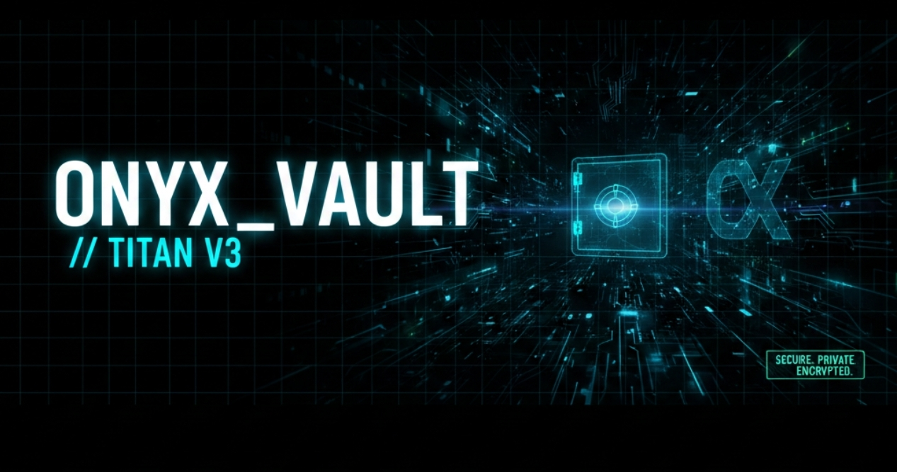

# 🛡️ OnyxVault: Enterprise-Grade Private Note Architect

> **Status:** 🟢 Live Production Environment
> **Access Point:** [https://shirooni.infinityfree.me/](https://shirooni.infinityfree.me/)

## ⚡ Quick Start
1. Navigate to the link above.
2. Register a new "Security Identity."
3. Your data is encrypted locally using AES-256 before being committed to the database.


A high-security, full-stack PHP vault designed with a focus on data privacy, cryptographic integrity, and modern UI/UX principles. This project demonstrates advanced implementation of the AES-256 encryption standard and secure session management.


---

## 🚀 Key Architectural Features

### 1. Cryptographic Security (AES-256-CBC)
Unlike standard applications that store data in plain text, OnyxVault utilizes the **OpenSSL library** to implement symmetric encryption. 
- **Encryption:** Notes are encrypted using AES-256-CBC before database insertion.
- **Initialization Vector (IV):** A unique IV is generated for every encryption cycle to prevent pattern recognition attacks.

### 2. Defensive Backend Engineering
- **PDO Prepared Statements:** Absolute protection against SQL Injection (SQLi) by separating query logic from data.
- **Bcrypt Hashing:** User passwords are never stored; only high-entropy hashes are retained using `PASSWORD_DEFAULT`.
- **Session Hardening:** Implements `session_regenerate_id(true)` upon authentication to mitigate Session Fixation attacks.

### 3. Modern Tech Stack
- **Backend:** PHP 8.x (Object-Oriented Architecture)
- **Database:** MySQL (Relational Schema with Foreign Key Constraints)
- **Frontend:** Tailwind CSS with a Glassmorphism design language for a high-end "SaaS" aesthetic.

## 📂 Project Structure
```text
├── includes/
│   ├── Auth.php      # Authentication Logic Class
│   └── Cipher.php    # Encryption/Decryption Engine
├── src/               # Minified CSS and JS
     ├── terminal.js   # Javascript
     ├── style.css     # Glasmorphism
     ├── assets/            
          ├── banner.png        # Main Dashboard look
          └── avatar.jpg        # Customised profile
     └── security_audit.json    # Security Manifest
├── config.php         # Database Configuration (Environment Specific)
├── dashboard.php      # Secure User Interface
└── index.php          # Entry Point
```
